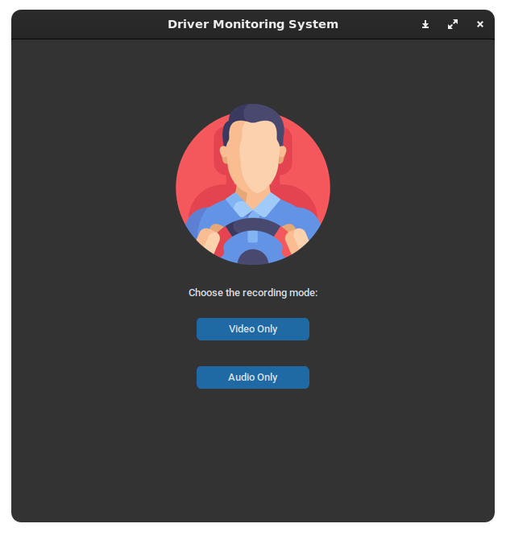
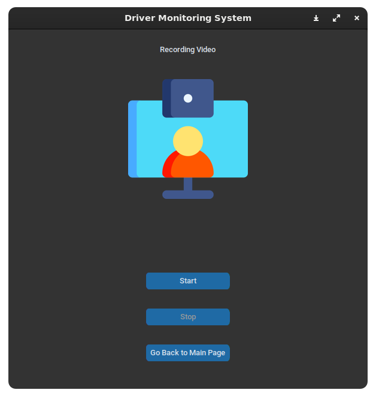
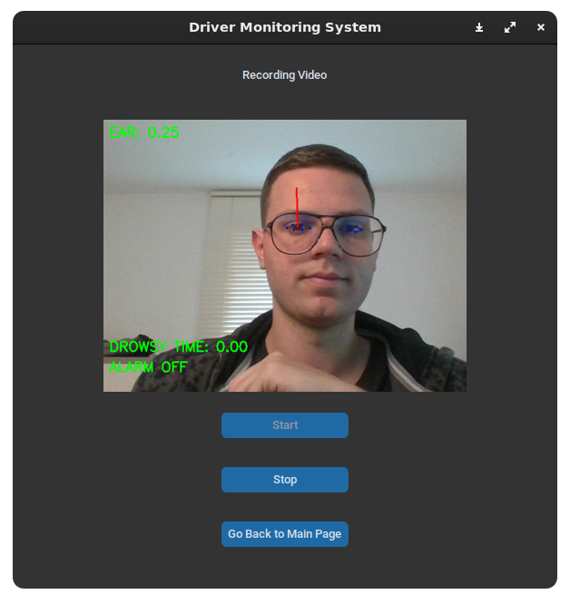
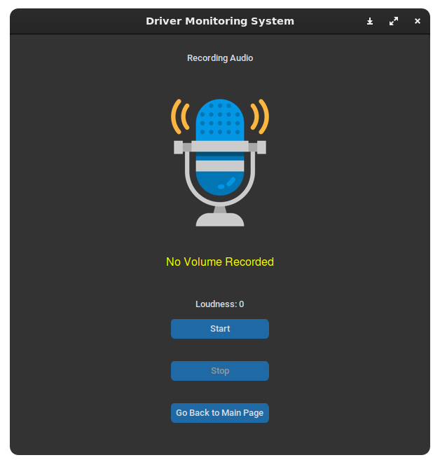
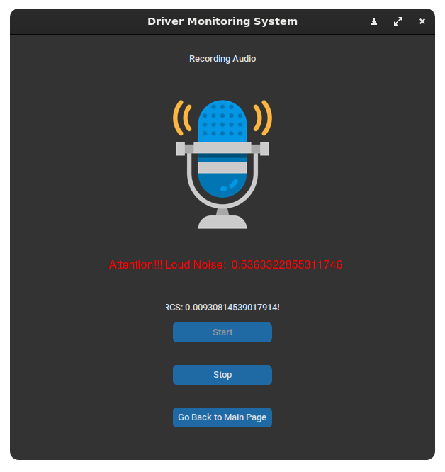

# multimodal-interaction-project
Project for the Multimodal Interaction course, for the master's degree program at the Sapienza University of Rome.

## How to use

From the terminal, run the following command:

### CLI

```cli
python app.py -e CLI -w video -t 10
```

- to record only the video for 10 seconds

```cli
python app.py -e CLI -w audio -t 10
```

- to record only the audio for 10 seconds

```cli
python app.py -e CLI -w both -t 10
```

- to record both audio and video for 10 seconds

### GUI

```cli
python app.py -e GUI: to run the GUI
```

- to use the graphical interface to record audio and video

#### GUI Main



#### GUI Video





#### GUI Audio





## BugFixing

If installation of requirements fail on PyAudio can'find portaudio.h do the following:

```cli
sudo apt install portaudio19-dev
```

If you use MacOS and you have problems with mediapipe, try to install the following version:

```cli
mediapipe==0.9.1.0
```

## Folder Structure

```text
.
├── data                        # Folder containing images for README.md
│  └── ...
├── docs                        # Folder containing documentation
│  └── ...
├── models                      # Folder containing models
│  └── ...
├── notebooks                   # Folder containing experiments and tests (not used in the project)
│  └── train.ipynb              # Notebook for training the model, it is the same code of folder train
├── references                  # Folder containing references documents
│  ├── images                   # Folder containing images referenced in the documents
│  │  └── canonical_face_model_uv_visualization.png # Points for face landmarks
│  └── test                     # Folder containing test scripts
│     └── ...
├── reports                     # Folder containing reports document and images
│  ├── figures                  # Folder containing images referenced in the documents
│  │  └── ...
│  └── ...
├── src                         # Folder containing source code
│  ├── app                      # Folder containing libraries for the project
│  │  ├── detection             # Folder containing detection libraries for the project
│  │  │  ├── detector.py        # Class for managing detection
│  │  │  ├── drowsiness.py      # Class for managing drowsiness detection
│  │  │  ├── looking_away.py    # Class for managing gaze direction detection
│  │  │  └── loudness.py        # Class for managing loudness detection
│  │  ├── gui                   # Folder containing gui libraries for the project
│  │  │  ├── controller.py      # Class for managing GUI
│  │  │  ├── main_frame.py      # Class for managing GUI main frame
│  │  │  ├── av_frame.py        # Class for managing GUI audio and video frame 
│  │  │  ├── video_frame.py     # Class for managing GUI video frame
│  │  │  └── audio_frame.py     # Class for managing GUI audio frame
│  │  ├── recording             # Folder containing recording libraries for the project
│  │  │  ├── recorder.py        # Class for managing recording
│  │  │  ├── recorder_video.py  # Class for managing video recording
│  │  │  └── recorder_audio.py  # Class for managing audio recording
│  │  └──  utils                # Folder containing utilities for the project
│  │     ├── config.py          # Class for managing configuration, as colors and paths values and names.
│  │     ├── ear.py             # Class for managing EAR value calculation
│  │     ├── face_mesh.py       # Class for managing face landmarks calculation
│  │     └── gaze.py            # Class for managing gaze direction calculation
│  ├── data                     # Folder containing data for the project
│  │  ├── audio                 # Folder containing audio data, as audio recordings.
│  │  │  └── ...
│  │  ├── dataset               # Folder containing dataframes.  
│  │  │  └── state-farm-distracted-driver-detection
│  │  │     └── ...
│  │  ├── images                # Folder containing images data, as images used fot the GUI of the project.
│  │  │  └── ...
│  │  └── video                 # Folder containing video data, as video recordings.            
│  │     └── ...
│  └── train                    # Folder containing training libraries for the project
│     ├── config.py             # Class for managing configuration, as path and learning parameters.
│     ├── dataset.py            # Class for managing dataset creation
│     ├── model.py              # Class for managing model creation
│     └── train.py              # Class for managing training
├── app.py                      # Main file for the project
├── README.md                   # This file
├── requirements.txt            # File containing requirements for the project
└── setup.py                    # File for setup the project
```
