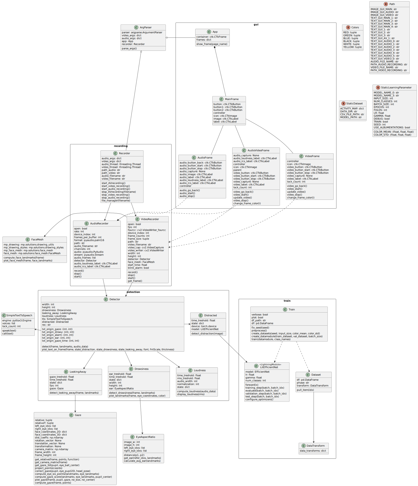

# DRIVER MONITORING SYSTEM

Project for the Multimodal Interaction course, for the master's degree program at the Sapienza University of Rome.

## Overview

In the modern era, road safety has become a significant concern of society. Human factors, such as **driver distraction**, **drowsiness** or **lack** of attention behind the steering wheel cause many road accidents.
More specifically, our goal is to detect such situations through the integration of different input modes, such as **gaze tracking**, **eyelid tracking**, and **driver activity** monitoring.

To achieve this goal, we have adopted **deep learning** approaches and **Computer Vision** techniques for processing and analyzing the data from the cameras inside the vehicle.
The driver monitoring system developed in our project can detect the driver's gaze, i.e. the direction and point of gaze fixation, to evaluate the driver's attention and concentration on the road. In addition, the system can identify signs of drowsiness, such as prolonged closing of the eyes.

In addition, the system can also detect driver distractions by analyzing their activities and positions while driving. This helps identify times when the driver might be distracted by external factors, such as mobile phone use or conversations with passengers.
If distraction or sleepiness is detected, the system can provide warnings or intervene to reduce the risk of an accident.

## Video Demo 


## Architecture

### Deployment Diagram


### Class Diagram



### Activity Diagram


### Sequence Diagram


## Use Cases


## GUI

To facilitate the tests and the presentation of the project we have decided to develop a \textit{simple graphical interface} that allows you to start an audio and/or video recording, and display the detection results of our system, showing the frames captured by the laptop's webcam, and processed drawing above them the points of the eyes, used for detecting drowsiness, and the line representing the direction of the gaze.


## Requirements

To use the real-time TTS (Text To Speech) feature, you need to install the following packages if you are using Linux:

```cli
 sudo apt update && sudo apt install espeak ffmpeg libespeak1
```

### BugFixing

If installation of requirements fail on PyAudio can'find portaudio.h do the following:

```cli
sudo apt install portaudio19-dev
```

If you use MacOS and you have problems with mediapipe, try to install the following version:

```cli
mediapipe==0.9.1.0
```

## How to use

You have two execution modes available, one that analyzes a video file, and another that records a video from the camera and processes it in real-time:

- From File:
    ```cli
    python app.py from_file -p path/to/video.avi
    ```

- From Camera:

    - CLI:
        ```cli
        python app.py from_camera -e CLI -w video -t 10
        ```
        - to record only the video for 10 seconds
        ```cli
        python app.py from_camera -e CLI -w audio -t 10
        ```
        - to record only the audio for 10 seconds
        ```cli
        python app.py from_camera -e CLI -w both -t 10
        ```
        - to record both audio and video for 10 seconds
    - GUI:
        ```cli
        python app.py from_camera -e GUI
        ```
        - to use the graphical interface to record audio and video


## Folder Structure

```text
.
├── data                        # Folder containing images for README.md
│  └── ...
├── docs                        # Folder containing documentation
│  └── ...
├── models                      # Folder containing models
│  └── ...
├── notebooks                   # Folder containing experiments and tests (not used in the project)
│  └── train.ipynb              # Notebook for training the model, it is the same code of folder train
├── references                  # Folder containing references documents
│  ├── images                   # Folder containing images referenced in the documents
│  │  └── canonical_face_model_uv_visualization.png # Points for face landmarks
│  └── test                     # Folder containing test scripts
│     └── ...
├── reports                     # Folder containing reports document and images
│  ├── figures                  # Folder containing images referenced in the documents
│  │  └── ...
│  └── ...
├── src                         # Folder containing source code
│  ├── app                      # Folder containing libraries for the project
│  │  ├── detection             # Folder containing detection libraries for the project
│  │  │  ├── detector.py        # Class for managing detection
│  │  │  ├── drowsiness.py      # Class for managing drowsiness detection
│  │  │  ├── looking_away.py    # Class for managing gaze direction detection
│  │  │  └── loudness.py        # Class for managing loudness detection
│  │  ├── gui                   # Folder containing gui libraries for the project
│  │  │  ├── controller.py      # Class for managing GUI
│  │  │  ├── main_frame.py      # Class for managing GUI main frame
│  │  │  ├── av_frame.py        # Class for managing GUI audio and video frame 
│  │  │  ├── video_frame.py     # Class for managing GUI video frame
│  │  │  └── audio_frame.py     # Class for managing GUI audio frame
│  │  ├── recording             # Folder containing recording libraries for the project
│  │  │  ├── recorder.py        # Class for managing recording
│  │  │  ├── recorder_video.py  # Class for managing video recording
│  │  │  └── recorder_audio.py  # Class for managing audio recording
│  │  └──  utils                # Folder containing utilities for the project
│  │     ├── config.py          # Class for managing configuration, as colors and paths values and names.
│  │     ├── ear.py             # Class for managing EAR value calculation
│  │     ├── face_mesh.py       # Class for managing face landmarks calculation
│  │     └── gaze.py            # Class for managing gaze direction calculation
│  ├── data                     # Folder containing data for the project
│  │  ├── audio                 # Folder containing audio data, as audio recordings.
│  │  │  └── ...
│  │  ├── dataset               # Folder containing dataframes.  
│  │  │  └── state-farm-distracted-driver-detection
│  │  │     └── ...
│  │  ├── images                # Folder containing images data, as images used fot the GUI of the project.
│  │  │  └── ...
│  │  └── video                 # Folder containing video data, as video recordings.            
│  │     └── ...
│  └── train                    # Folder containing training libraries for the project
│     ├── config.py             # Class for managing configuration, as path and learning parameters.
│     ├── dataset.py            # Class for managing dataset creation
│     ├── model.py              # Class for managing model creation
│     └── train.py              # Class for managing training
├── app.py                      # Main file for the project
├── README.md                   # This file
├── requirements.txt            # File containing requirements for the project
└── setup.py                    # File for setup the project
```
